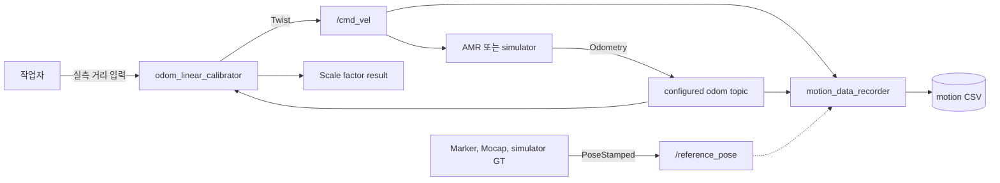

# 구성과 내부 구조

이 문서는 `odometry_calibrator`의 전체 구성, 노드 역할, 내부 module 경계를 설명한다.

## 패키지 목적

`odometry_calibrator`는 직선 주행 중 wheel odometry가 보고한 이동 거리와 실제 이동 거리의 차이를 확인하기 위한 ROS 2 Python 패키지다.

주요 목표는 두 가지다.

- `odom_linear_calibrator`: 로봇을 지정 거리만큼 움직이고 scale factor를 계산한다.
- `motion_data_recorder`: `/cmd_vel`, odometry, optional reference pose를 CSV로 저장한다.

시각화는 패키지 내부에서 하지 않는다. CSV는 PlotJuggler, Excel, spreadsheet, Python notebook, 별도 분석 script 같은 외부 도구에서 확인한다.

## 전체 구성



## 노드 역할

| 노드 | 내부 module | 역할 | publish | subscribe | 파일 출력 |
| --- | --- | --- | --- | --- | --- |
| `odom_linear_calibrator` | `calibration` | 목표 거리 주행, 실측 거리 입력, scale factor 계산 | configured `/cmd_vel` | configured odom topic | 없음 |
| `test_mock_odom_publisher` | `test_support` | smoke test support용 fixed-speed odometry source | configured mock odom topic | 없음 | 없음 |
| `motion_data_recorder` | `recording` | command/odom/reference 데이터를 CSV로 기록 | 없음 | configured `/cmd_vel`, configured odom topic, optional reference pose | CSV |

내부 구현은 `calibration`, `recording`, `common`, `test_support` module로 나뉘지만 ROS 2 package는 하나의 `odometry_calibrator`로 유지한다. 공통 axis/direction 처리, pose 계산, parameter validation, 결과 formatting은 `common` module에 둔다.

## 디렉토리 구조

```text
.
├── README.md
├── docs/
│   ├── architecture.md
│   ├── calibration.md
│   ├── data_recording.md
│   └── troubleshooting.md
└── src/
    └── odometry_calibrator/
        ├── config/
        │   ├── odom_linear_calibration.yaml
        │   └── motion_data_recording.yaml
        ├── launch/
        │   ├── test_calibration.launch.py
        │   └── data_recording.launch.py
        ├── odometry_calibrator/
        │   ├── calibration/
        │   │   ├── __init__.py
        │   │   ├── odom_linear_calibrator.py
        │   │   ├── cli_measurement_provider.py
        │   │   └── measurement_provider.py
        │   ├── recording/
        │   │   ├── __init__.py
        │   │   └── motion_data_recorder.py
        │   ├── common/
        │   │   ├── __init__.py
        │   │   ├── axis.py
        │   │   ├── motion_metrics.py
        │   │   ├── parameters.py
        │   │   ├── pose_utils.py
        │   │   └── result.py
        │   ├── test_support/
        │   │   ├── __init__.py
        │   │   └── mock_odom_publisher.py
        │   └── __init__.py
        └── test/
```

## 관련 문서

- 보정 절차: `calibration.md`
- Motion data recording: `data_recording.md`
- 진단과 문제 해결: `troubleshooting.md`
