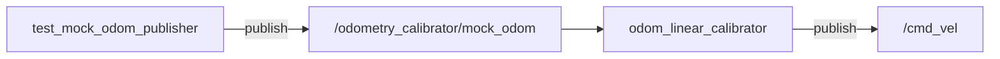
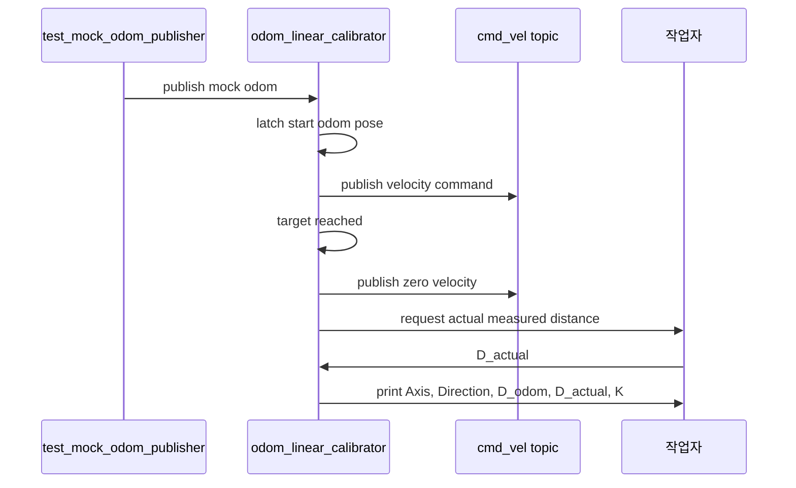
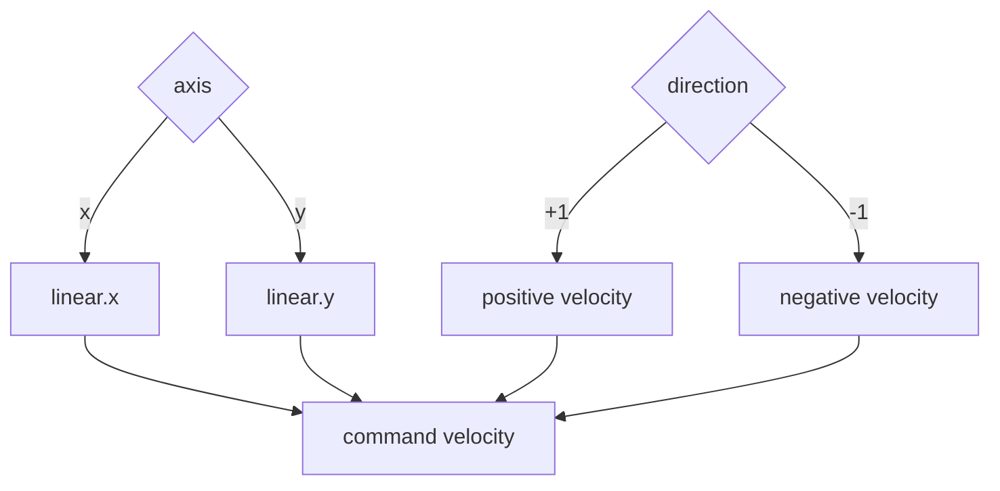
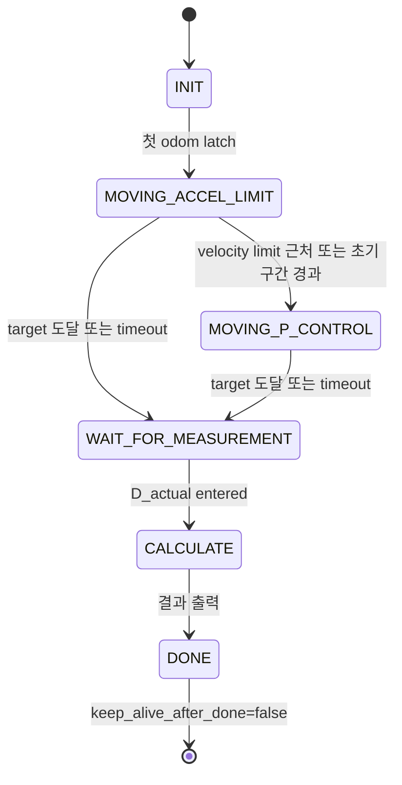

# Odometry Calibration 사용법

이 문서는 mock smoke test와 실제 AMR 직선 odometry calibration 절차를 설명한다.

## 빠른 Mock Smoke Test

가장 먼저 mock launch로 전체 흐름을 확인한다.

```bash
ros2 launch odometry_calibrator test_calibration.launch.py
```

이 launch는 실제 `/odom`과 충돌하지 않도록 odom topic을 `/odometry_calibrator/mock_odom`으로 override한다.

`test_mock_odom_publisher`는 fixed-speed odometry source이다. `/cmd_vel`을 subscribe하지 않고, robot simulator처럼 command를 추종하지 않는다.

mock launch의 topic 연결은 다음과 같다.



calibration 절차는 다음 순서로 진행된다.



## 실제 AMR Calibration 절차

1. 충분한 직선 주행 공간을 확보한다.
2. emergency stop 또는 수동 정지 수단을 준비한다.
3. 실제 robot의 command topic과 odom topic을 확인한다.
4. 낮은 `max_velocity`, `max_acceleration`으로 시작한다.
5. 처음에는 바퀴를 띄운 상태나 매우 낮은 속도로 direction만 확인한다.
6. `odom_linear_calibrator`를 실행한다.
7. 로봇이 정지하면 실제 이동 거리 `D_actual`을 입력한다.
8. 출력된 `K_x(+1)`, `K_x(-1)`, `K_y(+1)`, `K_y(-1)` 값을 축/방향별로 기록한다.

### +x 방향

```bash
ros2 run odometry_calibrator odom_linear_calibrator --ros-args \
  -p axis:=x \
  -p direction:=1 \
  -p target_distance:=0.5 \
  -p odom_topic:=/odom \
  -p cmd_vel_topic:=/cmd_vel
```

### -x 방향

```bash
ros2 run odometry_calibrator odom_linear_calibrator --ros-args \
  -p axis:=x \
  -p direction:=-1 \
  -p target_distance:=0.5
```

### +y 방향

```bash
ros2 run odometry_calibrator odom_linear_calibrator --ros-args \
  -p axis:=y \
  -p direction:=1 \
  -p target_distance:=0.5
```

### -y 방향

```bash
ros2 run odometry_calibrator odom_linear_calibrator --ros-args \
  -p axis:=y \
  -p direction:=-1 \
  -p target_distance:=0.5
```

YAML 파일에서는 `axis: "y"`처럼 quote를 권장한다. ROS 2 YAML parsing에서 unquoted `y`가 boolean `true`로 해석될 수 있기 때문이다.

## axis와 direction 의미



| axis | direction | command |
| --- | ---: | --- |
| `x` | `1` | `/cmd_vel.twist.linear.x = +v_cmd` |
| `x` | `-1` | `/cmd_vel.twist.linear.x = -v_cmd` |
| `y` | `1` | `/cmd_vel.twist.linear.y = +v_cmd` |
| `y` | `-1` | `/cmd_vel.twist.linear.y = -v_cmd` |

거리 계산은 다음 기준이다.

```text
raw_displacement = x - start_x  # axis == x
raw_displacement = y - start_y  # axis == y
axis_distance = max(direction * raw_displacement, 0.0)
remaining_distance = target_distance - axis_distance
```

로봇이 의도한 방향과 반대로 움직이면 `axis_distance`는 0으로 clamp된다. calibrator에서는 반대 방향 odom displacement가 tolerance보다 커지면 warning을 throttle해서 출력한다.

## odom_linear_calibrator 상태 흐름



`P_CONTROL`은 명령 추종 제어가 아니라 odom 기준 남은 거리 feedback 제어이다. `control_mode`에 따라 command velocity 계산 방식이 달라진다.

| `control_mode` | 의미 | 속도 계산 | 비고 |
| --- | --- | --- | --- |
| `constant` | 일반 정속 주행 | `max_velocity` | 목표 도달 전까지 일정 속도 명령 |
| `p` | 순수 P 제어 | `clamp(kp * remaining, 0, max_velocity)` | `min_velocity`를 적용하지 않음 |
| `p_min_clamped` | 최소속도 제한 P 제어 | `clamp(kp * remaining, min_velocity, max_velocity)` | 실사용 권장 기본값 |
| `p_stop_threshold` | 기존 동작 호환 | `kp * remaining < min_velocity`이면 정지 | 조기 종료 비교용 |

기본값은 `p_min_clamped`이다. 이 모드에서 `min_velocity`는 low-speed deadband를 피하기 위한 최소 주행 명령이며, 조기 종료 조건으로 사용하지 않는다.

## Calibration 결과 해석

예시:

```text
Axis      : x
Direction : +1
D_odom    : 0.500 m
D_actual  : 0.492 m
K_x(+1)   : 0.984000
```

계산식:

```text
K = D_actual / D_odom
```

위 예시는 odometry가 0.500 m 이동했다고 보고했지만 실제 이동은 0.492 m였다는 뜻이다. 따라서 해당 방향의 odometry scale에는 `0.984` 계열의 보정이 필요하다고 볼 수 있다.

## 관련 문서

- 전체 구조: `architecture.md`
- Recorder와 함께 기록: `data_recording.md`
- 문제 해결: `troubleshooting.md`
