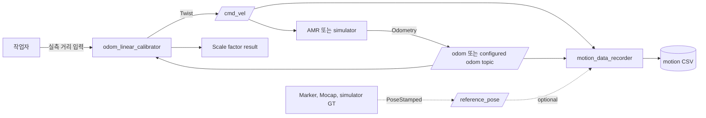
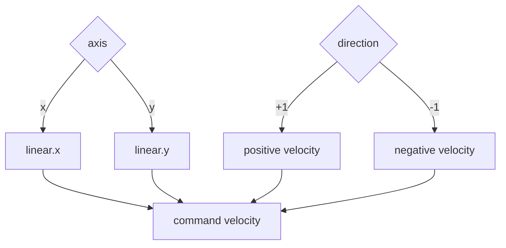
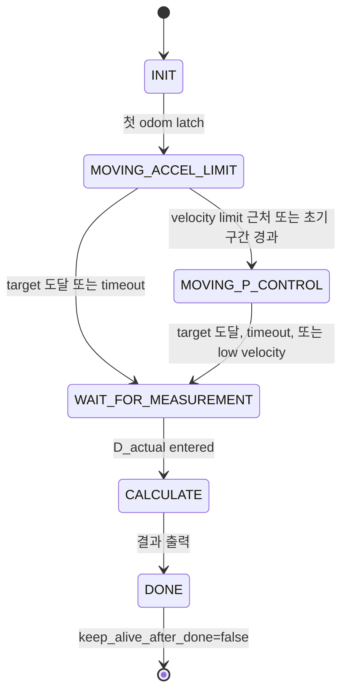
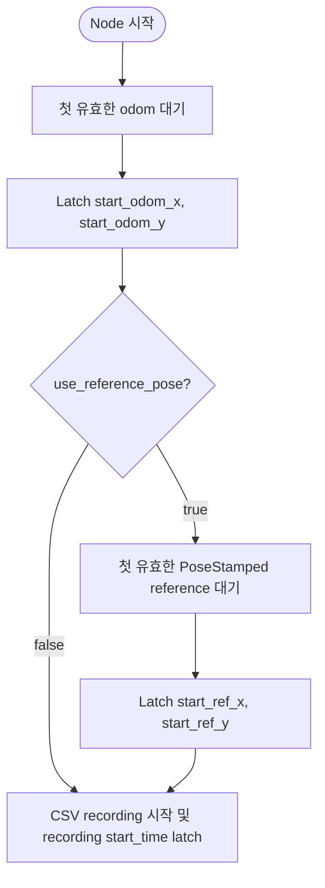
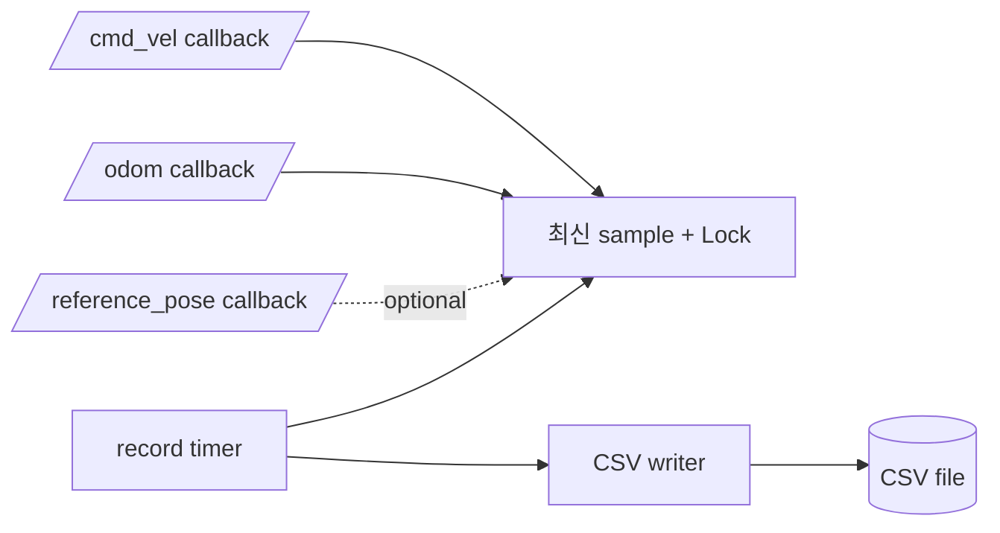
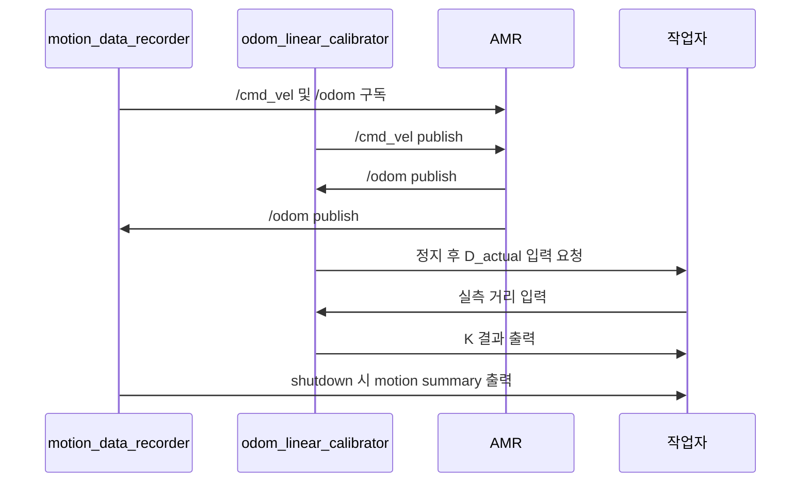

# odometry_calibrator 사용법과 구성

이 문서는 `odometry_calibrator` 패키지를 실제 AMR 저속 검증, mock smoke test, calibration 데이터 기록에 사용하는 방법을 설명한다.

## 패키지 목적

`odometry_calibrator`는 직선 주행 중 wheel odometry가 보고한 이동 거리와 실제 이동 거리의 차이를 확인하기 위한 ROS 2 Python 패키지다.

주요 목표는 두 가지다.

- `odom_linear_calibrator`: 로봇을 지정 거리만큼 움직이고 scale factor를 계산한다.
- `motion_data_recorder`: `/cmd_vel`, odometry, optional reference pose를 CSV로 저장한다.

시각화는 패키지 내부에서 하지 않는다. CSV는 PlotJuggler, Excel, spreadsheet, Python notebook, 별도 분석 script 같은 외부 도구에서 확인한다.

## 전체 구성



## 노드 역할

| 노드 | 역할 | publish | subscribe | 파일 출력 |
| --- | --- | --- | --- | --- |
| `odom_linear_calibrator` | 목표 거리 주행, 실측 거리 입력, scale factor 계산 | configured `/cmd_vel` | configured odom topic | 없음 |
| `test_mock_odom_publisher` | smoke test support용 fixed-speed odometry source | configured mock odom topic | 없음 | 없음 |
| `motion_data_recorder` | command/odom/reference 데이터를 CSV로 기록 | 없음 | configured `/cmd_vel`, configured odom topic, optional reference pose | CSV |

## 디렉토리 구조

```text
src/odometry_calibrator/
├── config/
│   ├── odom_linear_calibration.yaml
│   └── motion_data_recording.yaml
├── docs/
│   ├── data_recording.md
│   └── usage_and_architecture.md
├── launch/
│   ├── test_calibration.launch.py
│   └── data_recording.launch.py
├── odometry_calibrator/
│   ├── odom_linear_calibrator.py
│   ├── motion_data_recorder.py
│   ├── test_support/
│   │   ├── __init__.py
│   │   └── mock_odom_publisher.py
│   ├── axis.py
│   ├── motion_metrics.py
│   ├── pose_utils.py
│   ├── parameters.py
│   └── result.py
└── test/
```

## 빌드

워크스페이스 루트에서 실행한다.

```bash
export ROS_DISTRO=${ROS_DISTRO:-humble}
source /opt/ros/$ROS_DISTRO/setup.bash
colcon build --packages-select odometry_calibrator
source install/setup.bash
```

## 빠른 Mock Smoke Test

가장 먼저 mock launch로 전체 흐름을 확인한다.

```bash
ros2 launch odometry_calibrator test_calibration.launch.py
```

이 launch는 실제 `/odom`과 충돌하지 않도록 odom topic을 `/odometry_calibrator/mock_odom`으로 override한다.

```mermaid
sequenceDiagram
    participant Mock as test_mock_odom_publisher
    participant Cal as odom_linear_calibrator
    participant Cmd as /cmd_vel topic
    participant User as 작업자

    Note over Mock: fixed-speed odometry source; /cmd_vel을 subscribe하지 않음
    Mock->>Cal: /odometry_calibrator/mock_odom
    Cal->>Cal: latch start odom pose
    Cal->>Cmd: /cmd_vel publish
    Mock->>Cal: mock odom distance가 독립적으로 증가
    Cal->>Cal: target 도달
    Cal->>Cmd: zero /cmd_vel publish
    Cal->>User: 실제 측정 거리 입력 요청 [m]
    User->>Cal: D_actual
    Cal->>User: Axis, Direction, D_odom, D_actual, K 출력
```

## 실제 AMR Calibration 절차

1. 충분한 직선 주행 공간을 확보한다.
2. emergency stop 또는 수동 정지 수단을 준비한다.
3. 실제 robot의 command topic과 odom topic을 확인한다.
4. 낮은 `max_velocity`, `max_acceleration`으로 시작한다.
5. 처음에는 바퀴를 띄운 상태나 매우 낮은 속도로 direction만 확인한다.
6. `odom_linear_calibrator`를 실행한다.
7. 로봇이 정지하면 실제 이동 거리 `D_actual`을 입력한다.
8. 출력된 `K_x(+1)`, `K_x(-1)`, `K_y(+1)`, `K_y(-1)` 값을 축/방향별로 기록한다.

### +x 방향

```bash
ros2 run odometry_calibrator odom_linear_calibrator --ros-args \
  -p axis:=x \
  -p direction:=1 \
  -p target_distance:=0.5 \
  -p odom_topic:=/odom \
  -p cmd_vel_topic:=/cmd_vel
```

### -x 방향

```bash
ros2 run odometry_calibrator odom_linear_calibrator --ros-args \
  -p axis:=x \
  -p direction:=-1 \
  -p target_distance:=0.5
```

### +y 방향

```bash
ros2 run odometry_calibrator odom_linear_calibrator --ros-args \
  -p axis:=y \
  -p direction:=1 \
  -p target_distance:=0.5
```

### -y 방향

```bash
ros2 run odometry_calibrator odom_linear_calibrator --ros-args \
  -p axis:=y \
  -p direction:=-1 \
  -p target_distance:=0.5
```

YAML 파일에서는 `axis: "y"`처럼 quote를 권장한다. ROS 2 YAML parsing에서 unquoted `y`가 boolean `true`로 해석될 수 있기 때문이다.

## axis와 direction 의미



| axis | direction | command |
| --- | ---: | --- |
| `x` | `1` | `/cmd_vel.linear.x = +v_cmd` |
| `x` | `-1` | `/cmd_vel.linear.x = -v_cmd` |
| `y` | `1` | `/cmd_vel.linear.y = +v_cmd` |
| `y` | `-1` | `/cmd_vel.linear.y = -v_cmd` |

거리 계산은 다음 기준이다.

```text
raw_displacement = x - start_x  # axis == x
raw_displacement = y - start_y  # axis == y
axis_distance = max(direction * raw_displacement, 0.0)
remaining_distance = target_distance - axis_distance
```

로봇이 의도한 방향과 반대로 움직이면 `axis_distance`는 0으로 clamp된다. calibrator에서는 반대 방향 odom displacement가 tolerance보다 커지면 warning을 throttle해서 출력한다.

## odom_linear_calibrator 상태 흐름



## Calibration 결과 해석

예시:

```text
Axis      : x
Direction : +1
D_odom    : 0.500 m
D_actual  : 0.492 m
K_x(+1)   : 0.984000
```

계산식:

```text
K = D_actual / D_odom
```

위 예시는 odometry가 0.500 m 이동했다고 보고했지만 실제 이동은 0.492 m였다는 뜻이다. 따라서 해당 방향의 odometry scale에는 `0.984` 계열의 보정이 필요하다고 볼 수 있다.

## Motion Data Recorder 기본 사용

`motion_data_recorder`는 로봇을 움직이지 않는다. 실행 중인 robot, calibrator, simulator, rosbag replay가 publish하는 topic을 구독해 CSV로 저장한다.

`test_mock_odom_publisher`만 함께 실행하는 경우 `/cmd_vel` publisher가 없으므로 `cmd_vx`, `cmd_vy`, `cmd_wz`는 0으로 유지될 수 있다. 또한 test mock publisher는 `/cmd_vel`을 추종하는 closed-loop robot model이 아니라 smoke test support용 fixed-speed odometry source이므로, mock을 계속 켜두면 calibrator가 정지한 뒤에도 odometry distance는 계속 증가한다.

기본 실행:

```bash
ros2 launch odometry_calibrator data_recording.launch.py
```

직접 실행:

```bash
ros2 run odometry_calibrator motion_data_recorder --ros-args \
  -p odom_topic:=/odom \
  -p cmd_vel_topic:=/cmd_vel \
  -p axis:=x \
  -p direction:=1 \
  -p target_distance:=0.5 \
  -p output_dir:=logs \
  -p output_prefix:=calibration_x_pos \
  -p record_rate_hz:=20.0
```

파일명 예:

```text
logs/calibration_x_pos_20260605_203015.csv
```

## Recorder 시작 조건



Callback에서는 파일을 쓰지 않는다. 최신 message와 timestamp만 저장하고, timer callback에서 `record_rate_hz` 주기로 CSV row를 작성한다.



## Recorder CSV 컬럼

기본 컬럼:

```csv
time_sec,cmd_vx,cmd_vy,cmd_wz,odom_x,odom_y,odom_yaw,odom_distance,axis_distance,remaining_distance
```

| column | 의미 |
| --- | --- |
| `time_sec` | CSV recording이 실제 시작된 이후의 경과 시간 |
| `cmd_vx` | 최신 `/cmd_vel.linear.x` |
| `cmd_vy` | 최신 `/cmd_vel.linear.y` |
| `cmd_wz` | 최신 `/cmd_vel.angular.z` |
| `odom_x` | 최신 odom pose x |
| `odom_y` | 최신 odom pose y |
| `odom_yaw` | odom quaternion에서 계산한 yaw |
| `odom_distance` | 시작 odom pose 기준 2D 이동 거리 |
| `axis_distance` | `axis`와 `direction` 기준 이동 거리 |
| `remaining_distance` | `target_distance - axis_distance` |

reference pose 사용 시 추가 컬럼:

```csv
ref_x,ref_y,ref_yaw,ref_distance,ref_axis_distance,odom_ref_error,error_rate,scale_estimate
```

| column | 의미 |
| --- | --- |
| `ref_x` | 최신 reference pose x |
| `ref_y` | 최신 reference pose y |
| `ref_yaw` | reference quaternion에서 계산한 yaw |
| `ref_distance` | reference 시작점 기준 2D 이동 거리 |
| `ref_axis_distance` | reference 기준 axis/direction 이동 거리 |
| `odom_ref_error` | `axis_distance - ref_axis_distance` |
| `error_rate` | `odom_ref_error / ref_axis_distance` |
| `scale_estimate` | `ref_axis_distance / axis_distance` |

분모가 너무 작으면 `error_rate` 또는 `scale_estimate`는 빈 값으로 기록된다.

## Recorder Summary 예시

```text
=== Motion Data Summary ===
Axis                : x
Direction           : +1
Target distance     : 0.300 m
Final odom distance : 0.250 m
Axis distance       : 0.250 m
Remaining distance  : 0.050 m
Duration            : 10.84 s
Max cmd velocity    : 0.050 m/s
Avg cmd velocity    : 0.050 m/s
CSV saved           : logs/calibration_x_pos_20260605_203015.csv
```

reference pose가 있으면 다음 항목이 추가된다.

```text
Reference distance  : 0.240 m
Reference axis dist : 0.240 m
Odom-ref error      : +0.010 m
Odom-ref error rate : +4.17 %
Scale estimate      : 0.9600
```

## Calibrator와 Recorder 함께 실행

터미널 1:

```bash
ros2 run odometry_calibrator motion_data_recorder --ros-args \
  -p axis:=x \
  -p direction:=1 \
  -p target_distance:=0.5 \
  -p output_prefix:=calibration_x_pos
```

터미널 2:

```bash
ros2 run odometry_calibrator odom_linear_calibrator --ros-args \
  -p axis:=x \
  -p direction:=1 \
  -p target_distance:=0.5
```

이 구성을 사용하면 calibration 결과와 CSV motion log를 함께 남길 수 있다.



## Reference Pose와 함께 기록

외부 기준 pose가 `geometry_msgs/msg/PoseStamped`로 publish되는 경우:

```bash
ros2 run odometry_calibrator motion_data_recorder --ros-args \
  -p use_reference_pose:=true \
  -p reference_pose_topic:=/reference_pose \
  -p axis:=x \
  -p direction:=1 \
  -p target_distance:=0.5
```

사용 가능한 reference source 예:

- simulator ground truth
- marker tracking
- motion capture
- external localization system

현재는 message type 자동 판별을 하지 않는다. reference pose topic은 `geometry_msgs/msg/PoseStamped`여야 한다.

## Rosbag과 함께 사용

원본 topic을 rosbag으로 남기려면:

```bash
ros2 bag record /cmd_vel /odom
```

reference pose까지 포함:

```bash
ros2 bag record /cmd_vel /odom /reference_pose
```

rosbag replay 중 CSV를 다시 만들 수 있다.

터미널 1:

```bash
ros2 bag play <bag_directory>
```

터미널 2:

```bash
ros2 run odometry_calibrator motion_data_recorder --ros-args \
  -p output_prefix:=bag_replay
```

## rqt_graph로 연결 확인

`rqt_graph`는 데이터 값을 확인하는 도구가 아니라 node/topic 연결 관계를 확인하는 도구다. calibration 또는 recording이 정상 동작하지 않을 때 먼저 topic 연결을 확인하는 용도로 사용한다.

```bash
rqt_graph
```

mock launch 기준 기대 연결:

```text
test_mock_odom_publisher
  -> /odometry_calibrator/mock_odom
      -> odom_linear_calibrator

odom_linear_calibrator
  -> /cmd_vel
```

recorder까지 함께 실행한 경우:

```text
test_mock_odom_publisher
  -> /odometry_calibrator/mock_odom
      -> odom_linear_calibrator
      -> motion_data_recorder

odom_linear_calibrator
  -> /cmd_vel
      -> motion_data_recorder
```

`rqt_graph`로 확인할 수 있는 것은 연결 관계다. `odom_x`, `cmd_vx`, `axis_distance` 같은 실제 값은 `ros2 topic echo`, PlotJuggler, 또는 recorder CSV로 확인한다.

## PlotJuggler와 Spreadsheet 분석

PlotJuggler는 ROS topic 또는 recorder CSV를 시계열로 확인할 때 사용한다.

실행:

```bash
plotjuggler
```

ROS topic을 직접 볼 때 먼저 확인할 field:

```text
/cmd_vel.linear.x
/cmd_vel.linear.y
/odom.pose.pose.position.x
/odom.pose.pose.position.y
```

CSV에서 먼저 확인할 컬럼:

```text
time_sec
cmd_vx
cmd_vy
odom_x
odom_y
odom_distance
axis_distance
remaining_distance
odom_ref_error
scale_estimate
```

추천 plot 조합:

```text
time_sec vs axis_distance
time_sec vs remaining_distance
time_sec vs cmd_vx
time_sec vs cmd_vy
time_sec vs odom_distance
time_sec vs ref_axis_distance
time_sec vs odom_ref_error
time_sec vs scale_estimate
```

일반 calibration에서는 `axis_distance`가 증가하고 `remaining_distance`가 0 근처로 감소하는지 확인한다. reference pose가 있으면 `axis_distance`와 `ref_axis_distance`의 차이, `scale_estimate`가 안정적인지 확인한다.

Excel, LibreOffice, Google Sheets에서는 `time_sec`를 x축으로 두고 `axis_distance`, `remaining_distance`, `cmd_vx`, `cmd_vy`를 함께 보면 주행 command와 odometry 변화가 일관적인지 빠르게 확인할 수 있다.

## 파라미터 요약

### odom_linear_calibrator

| 파라미터 | 기본값 | 설명 |
| --- | ---: | --- |
| `odom_topic` | `/odom` | odometry 입력 topic |
| `cmd_vel_topic` | `/cmd_vel` | command velocity 출력 topic |
| `axis` | `"x"` | `x` 또는 `y` |
| `direction` | `1` | `1` 또는 `-1` |
| `target_distance` | `0.5` | 목표 이동 거리 |
| `distance_tolerance` | `0.005` | 목표 거리 도달 tolerance |
| `max_velocity` | `0.1` | 최대 command velocity |
| `max_acceleration` | `0.05` | acceleration limit |
| `motion_timeout_sec` | `20.0` | 이동 timeout |

### motion_data_recorder

| 파라미터 | 기본값 | 설명 |
| --- | ---: | --- |
| `odom_topic` | `/odom` | odometry 입력 topic |
| `cmd_vel_topic` | `/cmd_vel` | command velocity 입력 topic |
| `use_reference_pose` | `false` | reference pose 구독 여부 |
| `reference_pose_topic` | `""` | PoseStamped reference topic |
| `axis` | `"x"` | `x` 또는 `y` |
| `direction` | `1` | `1` 또는 `-1` |
| `target_distance` | `1.0` | remaining distance 계산 기준 |
| `output_dir` | `logs` | CSV 저장 directory |
| `output_prefix` | `motion` | CSV filename prefix |
| `record_rate_hz` | `20.0` | CSV 기록 주기 |
| `summary_on_shutdown` | `true` | 종료 시 summary 출력 여부 |

## 실제 로봇 테스트 체크리스트

- mock launch로 먼저 흐름을 검증한다.
- 실제 robot의 command topic이 `cmd_vel_topic`과 일치하는지 확인한다.
- 실제 wheel odometry topic이 `odom_topic`과 일치하는지 확인한다.
- `axis`와 `direction` 조합이 의도한 주행 방향과 일치하는지 확인한다.
- emergency stop 또는 수동 정지 수단을 준비한다.
- `target_distance`보다 긴 직선 공간을 확보한다.
- 처음에는 낮은 `max_velocity`, 낮은 `max_acceleration`으로 실행한다.
- 바퀴를 띄운 상태 또는 매우 낮은 속도로 command 방향만 먼저 확인한다.
- `motion_data_recorder`를 함께 실행해 CSV를 남긴다.
- calibration 결과와 CSV summary의 축/방향이 같은지 확인한다.

## 문제 해결

### `axis: y`가 이상하게 들어오는 경우

YAML에서는 다음처럼 quote를 사용한다.

```yaml
axis: "y"
```

### recorder가 CSV를 만들지 않는 경우

다음을 확인한다.

- odom topic이 실제 publish되고 있는가
- `odom_topic` 파라미터가 실제 topic 이름과 같은가
- `use_reference_pose=true`인데 reference pose가 publish되지 않는 상태는 아닌가
- `output_dir`에 write 권한이 있는가

### reference 관련 컬럼이 비어 있는 경우

`ref_axis_distance` 또는 `axis_distance`가 너무 작으면 ratio 계산 분모가 작기 때문에 `error_rate`, `scale_estimate`가 빈 값이 될 수 있다.

### ROS 2 topic 연결 확인

```bash
ros2 topic list
ros2 topic info /odom
ros2 topic info /cmd_vel
ros2 topic echo /odom --once
```

custom topic을 쓰는 경우:

```bash
ros2 topic info /my_robot/wheel_odom
ros2 topic info /my_robot/cmd_vel
```
